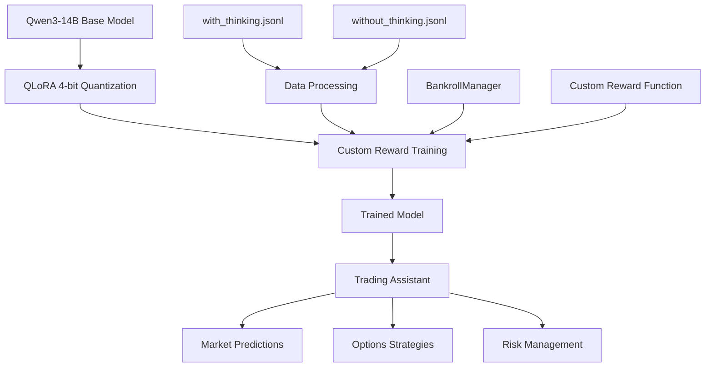

# Cooler_Qwen3_14b (Previously Codename: Ginyu-Unit)

⚠️ WARNING: No guarantees of effectiveness! ⚠️


⚠️ This content is strictly for educational purposes. The author explicitly states that it is not intended for use on live stocks or a live account. 

⚠️ Only use for practice trading with NO REAL MONEY.

⚠️ Nothing here constitutes financial advice. Always consult a qualified professional before making financial decisions. Additionally, outputs from a large language model (LLM) should never be considered inherently trustworthy—exercise caution and critical thinking at all times. 

⚠️ Proceed at your own risk! 


## Overview

Cooler_Qwen3_14b transforms the Qwen3-14B model into a trading assistant through reinforcement learning with custom reward mechanisms. The model is designed to:

- Analyze market data to make precise directional predictions (UP/DOWN/STRONG_UP/STRONG_DOWN)
- Provide actionable options trading strategies with specific strike prices and expirations
- Explain reasoning with both technical analysis and fundamental context
- Adapt to different timeframes (hourly, daily, weekly, monthly)
- Manage position sizing based on confidence level

### System Architecture



## Technical Implementation

- **QLoRA 4-bit Quantization**: Enables efficient fine-tuning of 14B parameter models
- **Reinforcement Learning**: Custom reward function optimizes for prediction accuracy and trading performance
- **Bankroll Management**: Simulates trading outcomes with dynamic capital allocation
- **Memory Optimization**: Gradient accumulation and chunked processing for efficient training
- **Colab Compatibility**: Designed to run on Google Colab with limited VRAM

### Training Process Flow

```
┌─────────────────┐       ┌─────────────────┐       ┌─────────────────┐
│                 │       │                 │       │                 │
│   Base Model    │──────▶│ QLoRA Adapters  │──────▶│ Forward Pass    │
│   (Qwen3-14B)   │       │ (4-bit)         │       │ (Prediction)    │
│                 │       │                 │       │                 │
└─────────────────┘       └─────────────────┘       └────────┬────────┘
                                                             │
                                                             ▼
┌─────────────────┐       ┌─────────────────┐       ┌─────────────────┐
│                 │       │                 │       │                 │
│  Apply Weights  │◀──────│ Backpropagation │◀──────│ Reward Function │
│  & Update LoRA  │       │ (REINFORCE)     │       │ Evaluation      │
│                 │       │                 │       │                 │
└─────────────────┘       └─────────────────┘       └─────────────────┘
```

## Requirements

- **Hardware**: NVIDIA GPU with at least 40GB VRAM (A100 or equivalent)
- **Software**:
```
torch
transformers>=4.31.0
peft>=0.4.0
bitsandbytes>=0.40.0
accelerate>=0.20.0
datasets
tqdm
pandas
```

Even with 4-bit quantization, the model's memory footprint requires high-end GPU resources due to the 14B parameter size.

### Memory Usage Breakdown

| Component | Memory Usage |
|-----------|--------------|
| Base Model (4-bit) | ~7GB |
| KV Cache | ~18GB |
| Gradients | ~10GB |
| Optimizer States | ~5GB |
| Miscellaneous | ~2GB |
| **Total** | **~42GB** |

## Setup

### Local Installation

1. Clone the repository:
```bash
git clone https://github.com/YOUR_USERNAME/Cooler_Qwen3_14b.git
cd Cooler_Qwen3_14b
```

2. Install dependencies:
```bash
pip install -r requirements.txt
```

### Google Colab

The script includes built-in Colab detection and will automatically:
- Mount Google Drive
- Install required packages
- Configure the environment

## Data Format

Training data should be in JSONL format with two key files:
- `with_thinking.jsonl`: Samples that include step-by-step reasoning
- `without_thinking.jsonl`: Samples with direct predictions

Each sample should contain:
```json
{
  "messages": [{"role": "user", "content": "Analyze XYZ stock and predict movement"}],
  "thinking_structured": {
    "prediction": "UP",
    "reasoning": "Price is above 200-day MA with increasing volume...",
    "historical_context": "Stock has shown positive momentum for 3 weeks..."
  },
  "ticker": "XYZ",
  "datetime_str": "2023-05-01 14:30:00",
  "future_prices": [145.20, 146.30, 147.10, 145.80, 148.20],
  "current_price": 145.20
}
```

### Data Processing Pipeline

```
┌─────────────────┐       ┌─────────────────┐       ┌─────────────────┐
│                 │       │                 │       │                 │
│  JSONL Loading  │──────▶│ Data Merging &  │──────▶│ Timeframe       │
│  & Parsing      │       │ Preprocessing   │       │ Detection       │
│                 │       │                 │       │                 │
└─────────────────┘       └─────────────────┘       └────────┬────────┘
                                                             │
                                                             ▼
┌─────────────────┐       ┌─────────────────┐       ┌─────────────────┐
│                 │       │                 │       │                 │
│  Dataset        │◀──────│ Tokenization &  │◀──────│ Sample Labeling │
│  Creation       │       │ Formatting      │       │ (has_thinking)  │
│                 │       │                 │       │                 │
└─────────────────┘       └─────────────────┘       └─────────────────┘
```

## Configuration

Key parameters that can be modified in the script:

```python
# Model configuration
model_name = "Qwen/Qwen3-14B"  # Base model
output_dir = "qwen3_14b_memory_optimized_lora"  # Output path

# LoRA configuration
lora_config = LoraConfig(
    r=16,  # Rank
    lora_alpha=32,  # Alpha scaling
    target_modules=["q_proj", "k_proj", "v_proj", "o_proj", "gate_proj", "up_proj", "down_proj"],
    lora_dropout=0.05
)

# Training parameters
batch_size = 1
num_epochs = 1
learning_rate = 2e-5
```

### Parameter Descriptions

| Parameter | Description | Recommended Range |
|-----------|-------------|------------------|
| `r` | LoRA rank - controls the expressivity of adapter weights | 8-64 |
| `lora_alpha` | LoRA scaling factor - impacts learning rate | 16-64 |
| `target_modules` | Modules to apply LoRA to | Model-specific |
| `lora_dropout` | Dropout rate for LoRA layers | 0.05-0.15 |
| `learning_rate` | Optimizer learning rate | 1e-5 to 5e-5 |
| `tokens_per_update` | Token batch size for gradient accumulation | 32-128 |

## Usage

### Running Training

1. Place your data files in the appropriate location:
```
/content/drive/MyDrive/Big_Data/with_thinking.jsonl
/content/drive/MyDrive/Big_Data/without_thinking.jsonl
```

2. Run the script:
```bash
python SS1.py
```

3. For custom data paths:
```python
# Modify these lines in the script
with_thinking_path = '/path/to/with_thinking.jsonl'
without_thinking_path = '/path/to/without_thinking.jsonl'
```

### Training Monitoring

The script provides detailed logs during training:
- Input/output samples
- Reward calculations and components
- Token-level loss information
- Bankroll management metrics

#### Sample Training Output

```
DEBUG - Detected timeframe: hourly
DEBUG - Using global bankroll manager with current capital $205.50
DEBUG - Sample structure:
Sample keys: ['messages', 'thinking_structured', 'ticker', 'datetime_str', 'future_prices', 'current_price']
Number of messages: 2
Message keys: ['role', 'content']
Thinking structured keys: ['prediction', 'reasoning', 'historical_context']

Reward: 1.85, Total loss: 2.43
```

### Output

The trained model is saved to the specified output directory with:
- LoRA adapter weights
- Tokenizer files
- Configuration

## Inference

Load the fine-tuned model for inference:

```python
from transformers import AutoModelForCausalLM, AutoTokenizer
from peft import PeftModel

# Load base model and tokenizer
base_model = AutoModelForCausalLM.from_pretrained(
    "Qwen/Qwen3-14B", 
    device_map="auto",
    trust_remote_code=True
)
tokenizer = AutoTokenizer.from_pretrained("Qwen/Qwen3-14B", trust_remote_code=True)

# Load LoRA weights
model = PeftModel.from_pretrained(base_model, "qwen3_14b_memory_optimized_lora")

# Create inference function
def get_prediction(ticker, timeframe="hourly"):
    prompt = f"Analyze {ticker} with {timeframe} chart. Predict direction and options strategy."
    messages = [{"role": "user", "content": prompt}]
    prompt = tokenizer.apply_chat_template(messages, tokenize=False, add_generation_prompt=True)
    
    inputs = tokenizer(prompt, return_tensors="pt").to(model.device)
    outputs = model.generate(**inputs, max_new_tokens=256)
    
    return tokenizer.decode(outputs[0], skip_special_tokens=True)

# Example use
prediction = get_prediction("XYZ", "daily")
print(prediction)
```

### Example Output Format

```
<thinking>
XYZ is showing bullish momentum with price action above the 20-day EMA. 
Volume has increased on up days and RSI is at 62, not yet overbought. 
MACD shows positive momentum with recent golden cross.
</thinking>

**HOURLY PREDICTION: UP**
XYZ likely to continue upward movement over next few hours based on positive 
momentum and institutional buying patterns.

**2-WEEK OPTIONS STRATEGY:**
Buy XYZ $185 CALL, 10 days expiration
Entry: $3.20, Exit: When premium reaches $4.80 (50% profit) or $2.40 (25% loss)
Position size: 15% of capital (Confidence: 70%)
```

## Reward System

The model is optimized using a custom reward function that incentivizes:

1. **Accurate predictions**: Higher rewards for correctly predicting price movements
2. **Technical analysis**: Use of appropriate technical indicators and terminology
3. **Clear formatting**: Using the dual prediction format (hourly + options)
4. **Risk management**: Specifying stop-loss and take-profit levels
5. **Position sizing**: Appropriate position sizing based on confidence

### Reward Calculation Example

Below is a sample of the reward calculation process during training, showing how different components contribute to the final reward:

```
# Prediction Detection
DEBUG - Found prediction term: BULLISH
DEBUG - Context: '...moving average, which might indicate a bullish trend. The MA4 is 128.04...'
DEBUG - Expected prediction: UP
DEBUG - Detected prediction: UP
DEBUG - Found matching prediction 'UP' in completion

# Risk Management Detection
DEBUG - Found exit condition: close, volume, ma8
DEBUG - Found complete trade plan with entry and exit

# Reward Components Breakdown
Reward components: {
  'non_empty': 0.1,              # Base reward for generating content
  'technical_terms': 0.2,        # Using technical analysis terms
  'multiple_technical_terms': 0.3, # Using multiple technical indicators
  'clear_prediction': 0.5,       # Making a clear directional prediction
  'correct_prediction': 1.0,     # Matching the expected direction
  'price_mention': 0.2,          # Mentioning specific price levels
  'exit_condition': 0.3,         # Specifying when to exit the trade
  'accuracy_reward_0-10%': 0.3,  # Small reward for accuracy (small % move)
  'complete_trade_plan': 0.3     # Providing both entry and exit points
}
Total reward: 3.2

# Bankroll Simulation
DEBUG - Starting trade with $230.88 capital
DEBUG - Investing $63.49 (27.5%) in UP trade
DEBUG - Remaining capital: $167.39
DEBUG - Trade SYMBOL_103 UP from $127.73 to $128.25 (held)
DEBUG - Invested: $63.49, Final value: $63.75, P&L: $0.26 (0.41%)
DEBUG - New account balance: $231.14
DEBUG - Bankroll evaluation results: {
  'winning_trade': 0.5,           # Reward for profitable trade
  'appropriate_position_size': 0.2 # Good position sizing based on confidence
}
```

This example shows how the model is rewarded for accurate predictions, proper technical analysis, risk management, and overall trading performance through the bankroll simulation.

### Reward Calculation Architecture

```
┌─────────────────────┐       ┌─────────────────────┐
│                     │       │                     │
│  Prediction Rewards │──────▶│  Directional Match  │
│                     │       │  (UP/DOWN)          │
│                     │       │                     │
└─────────────────────┘       └─────────────────────┘
          │
          │
          ▼
┌─────────────────────┐       ┌─────────────────────┐
│                     │       │                     │
│  Format Rewards     │──────▶│  Dual Prediction    │
│                     │       │  Format Adherence   │
│                     │       │                     │
└─────────────────────┘       └─────────────────────┘
          │
          │
          ▼
┌─────────────────────┐       ┌─────────────────────┐
│                     │       │                     │
│  Technical Analysis │──────▶│  Key Term Usage     │
│  Rewards            │       │  & Context          │
│                     │       │                     │
└─────────────────────┘       └─────────────────────┘
          │
          │
          ▼
┌─────────────────────┐       ┌─────────────────────┐
│                     │       │                     │
│  Risk Management    │──────▶│  Stop-Loss &        │
│  Rewards            │       │  Take-Profit Levels │
│                     │       │                     │
└─────────────────────┘       └─────────────────────┘
          │
          │
          ▼
┌─────────────────────┐       ┌─────────────────────┐
│                     │       │                     │
│  Bankroll Simulation│──────▶│  Trade Performance  │
│  Rewards            │       │  & Outcomes         │
│                     │       │                     │
└─────────────────────┘       └─────────────────────┘
```

### Detailed Reward Components

| Component | Description | Max Reward |
|-----------|-------------|------------|
| Technical Terms | Using market analysis terminology | 0.5 |
| Clear Prediction | Explicit UP/DOWN direction | 0.5 |
| Correct Prediction | Matching expected direction | 1.0 |
| Early Prediction | Making prediction early in response | 0.5 |
| Dual Format | Using proper hourly+options format | 0.4 |
| Strike Price | Specifying option strike price | 0.2 |
| Expiration | Appropriate expiration timeframe | 0.2 |
| Stop-Loss | Defining stop-loss levels | 0.3 |
| Take-Profit | Defining take-profit targets | 0.3 |
| Bankroll Performance | Simulated trade outcome | 0.5-1.0 |

## Troubleshooting

### CUDA Out of Memory

If you encounter OOM errors:
- Reduce the `tokens_per_update` value (default: 64)
- Ensure you're using 4-bit quantization
- Try increasing the frequency of `torch.cuda.empty_cache()` calls

**Memory Optimization Techniques Used:**
```python
# Memory optimization through gradient checkpointing
model.gradient_checkpointing_enable()

# Memory optimization through chunked processing
for i in range(0, output_length, tokens_per_update):
    # Process chunks of tokens instead of entire sequence
    chunk_end = min(i + tokens_per_update, output_length)
    
    # Clean memory periodically
    if i % (tokens_per_update * 4) == 0:
        torch.cuda.empty_cache()
```

### Token ID Errors

If you see "Out-of-vocab token detected!":
- Check if tokenizer vocabulary size matches model vocabulary size
- Ensure proper padding and special token handling

## Advanced Usage

### Custom Reward Functions

You can modify the `custom_reward` function to implement different optimization targets:

```python
def custom_reward(sample, completion):
    # Your custom reward logic here
    reward = 0.0
    
    # Example: Reward for specific concepts
    if "support level" in completion.lower():
        reward += 0.2
    
    return reward
```

### Bankroll Manager

The built-in bankroll manager simulates trading outcomes. Configure parameters:

```python
manager = BankrollManager(
    initial_capital=200.0,  # Starting capital
    position_size_pct=0.20,  # Default position size
    max_position_pct=0.50    # Maximum position size
)
```

#### Bankroll Manager Logic Flow

```
┌─────────────────┐       ┌─────────────────┐       ┌─────────────────┐
│                 │       │                 │       │                 │
│  Prediction     │──────▶│  Position Size  │──────▶│  Trade Entry    │
│  Evaluation     │       │  Calculation    │       │  Execution      │
│                 │       │                 │       │                 │
└─────────────────┘       └─────────────────┘       └────────┬────────┘
                                                             │
                                                             ▼
┌─────────────────┐       ┌─────────────────┐       ┌─────────────────┐
│                 │       │                 │       │                 │
│  Reward         │◀──────│  P&L            │◀──────│  Trade Exit     │
│  Assignment     │       │  Calculation    │       │  Conditions     │
│                 │       │                 │       │                 │
└─────────────────┘       └─────────────────┘       └─────────────────┘
```

### Memory-Optimized Training Loop

The training loop is designed for memory efficiency through:

1. Chunked token processing with gradient accumulation
2. Periodic CUDA cache clearing
3. Gradient checkpointing with `use_reentrant=False`
4. Dynamic sequence length limiting
5. 4-bit weight quantization

```python
# Sample code for memory-optimized forward pass
def optimized_forward_pass(model, inputs, output_ids, reward_tensor):
    total_loss = 0.0
    prompt_length = inputs['input_ids'].shape[1]
    output_length = output_ids.shape[1] - prompt_length
    
    # Process in chunks
    for i in range(0, output_length, tokens_per_update):
        optimizer.zero_grad()
        chunk_end = min(i + tokens_per_update, output_length)
        chunk_size = chunk_end - i
        chunk_loss = 0.0
        
        # Process each token in chunk
        for j in range(i, chunk_end):
            # Forward pass for single token prediction
            prefix_length = prompt_length + j
            current_input_ids = output_ids[:, :prefix_length]
            target_id = output_ids[:, prefix_length]
            
            # Get logits and apply REINFORCE
            outputs = model(input_ids=current_input_ids)
            logits = outputs.logits[:, -1, :]
            log_probs = F.log_softmax(logits, dim=-1)
            token_log_prob = log_probs[0, target_id[0]]
            token_loss = -token_log_prob * reward_tensor[j]
            
            # Accumulate loss
            chunk_loss += token_loss / chunk_size
            
        # Backpropagate and update for this chunk
        chunk_loss.backward()
        optimizer.step()
        
        # Clear memory periodically
        if i % (tokens_per_update * 4) == 0:
            torch.cuda.empty_cache()
            
    return total_loss
```

## Acknowledgments

Based on the Qwen3-14B model by the Qwen team at Alibaba Cloud.

## License


#### Begin Deprecated Readme.md ####

## Owner
**./install_AI**

## Files

- **Bulma**: Energy Sector SFT Trainer & Energy Sector stonk scaper via yfinance. Generates synthetic missing data, thinking trace, and 85-98 variant thinking traces per stock via Groq that are grounded in truth. The default will generate over 2,000 synthetic variant days to train on. A Groq API Key is required. 
- **Krillon.py**: Stage 1 SFT (Supervised Fine-Tuning) script for initial model training
- **Piccolo.py**: Stage 2 GRPO training script with balanced dataset (50% UP, 50% DOWN)
- **Kakarot.py**: Stage 3 RLHF training script for the model
- **Vegeta.py**: Inference script for making predictions with trained models
- **Over9Thousand.py**: Core library with model training and utility functions
- **train_stage1.sh**: Shell script for stage 1 SFT training
- **train_stage2.sh**: Shell script for stage 2 GRPO training with balanced dataset
- **train_stage3.sh**: Shell script for stage 3 GRPO training
- **test_inference.sh**: Shell script for testing model predictions

## Training Process

The Gi-Unit project uses a three-stage training approach:

1. **Stage 1 (Krillon)**: Supervised Fine-Tuning (SFT) to teach the model the proper format and basic prediction capabilities
2. **Stage 2 (Piccolo)**: Intermediate GRPO training with a balanced dataset (50% UP, 50% DOWN) for easier prediction learning
3. **Stage 3 (Kakarot)**: Advanced GRPO training with the full dataset and enhanced rewards for prediction accuracy and analysis quality

This progressive training approach ensures the model learns the proper format first, then gradually improves its prediction accuracy and reasoning capabilities.

## Reward System

The Gi-Unit project implements a progressive reward system across its three training stages:

### Stage 1 (Krillon)
- Uses standard supervised fine-tuning without explicit rewards
- Focuses on teaching the model proper format and basic prediction capabilities

### Stage 2 (Piccolo)
- Moderate rewards for correct predictions (+3.5)
- Balanced penalties for incorrect predictions (-1.5)
- Format compliance rewards for proper structure
- Percentage accuracy rewards based on prediction precision

### Stage 3 (Kakarot)
- Asymmetric rewards favoring DOWN predictions:
  - Correct UP prediction: **+3.8**
  - Correct DOWN prediction: **+4.0** (higher to favor safer predictions)
- Stronger penalties for incorrect predictions (-2.0)
- Sophisticated analysis quality rewards for:
  - Mentioning specific financial metrics
  - Including technical indicators
  - Providing balanced analysis
- Minimum reward floor ensuring correct predictions always receive positive reinforcement

This progressive system guides the model from basic format compliance to sophisticated financial analysis and accurate predictions, with a slight bias toward safer DOWN predictions in uncertain market conditions.

## Usage

### Training

You can train the model using either the Python script directly or the provided shell script:

#### Using the Python script:

```bash
python Kakarot.py \
    --dataset_path "2084Collective/deepstock-sp500-companies-with-info-and-user-prompt" \
    --output_dir outputs_namek \
    --max_samples 5000 \
    --debug
```

#### Using the shell script:

```bash
./train_stage3.sh
```

#### Training Parameters:

- `--dataset_path`: Path to the dataset (default: "2084Collective/deepstock-sp500-companies-with-info-and-user-prompt")
- `--output_dir`: Directory to save model checkpoints (default: "outputs_namek")
- `--max_samples`: Maximum number of samples to use for training (default: None, uses all samples)
- `--debug`: Enable verbose logging to see full model responses
- `--use_pretrained_checkpoint`: Path to a checkpoint to continue training from
- `--num_train_epochs`: Number of training epochs (default: 1)
- `--max_steps`: Maximum number of training steps (default: 10)
- `--per_device_train_batch_size`: Batch size per device (default: 1)

### Inference (Vegeta)

You can run inference using either the Python script directly or the provided test script:

#### Using the Python script:

```bash
python Vegeta.py \
    --model_path "path/to/trained/model" \
    --ticker "MSFT" \
    --company_name "Microsoft Corporation" \
    --current_price 425.52 \
    --previous_price 422.86 \
    --sector "Technology" \
    --industry "Software" \
    --revenue 211900000000 \
    --net_income 72361000000 \
    --eps 9.71 \
    --pe_ratio 33.1 \
    --rsi 65.2 \
    --macd 2.1 \
    --moving_avg_50 410.5 \
    --moving_avg_200 390.2 \
    --news "Microsoft announces new AI features" "Cloud revenue grows 22% in Q2"
```

#### Using the test script:

```bash
./test_inference.sh
```

The test script will run predictions for both Microsoft (bullish case) and Tesla (bearish case) using the pre-trained model.

#### Inference Parameters:

- `--model_path`: Path to the trained model (required)
- `--ticker`: Stonk ticker symbol (required)
- `--company_name`: Company name (required)
- `--current_price`: Current stonk price (required)
- `--previous_price`: Previous stonk price (required)
- `--sector`: Company sector
- `--industry`: Company industry
- `--revenue`: Company revenue
- `--net_income`: Company net income
- `--eps`: Earnings per share
- `--pe_ratio`: Price to earnings ratio
- `--rsi`: RSI value
- `--macd`: MACD value
- `--moving_avg_50`: 50-day moving average
- `--moving_avg_200`: 200-day moving average
- `--news`: Recent news headlines (multiple can be provided)

## Model Output Format

The model generates predictions in a structured format:

```
<think>
Key Factors:
1. [First key observation]
2. [Second key observation]
3. [Third key observation]

Analysis:
[Detailed analysis of technical indicators, financial metrics, and market sentiment]
</think>

<answer>direction: up change: X.X%</answer>
```

## Features

- Real-time stonk market prediction
- Detailed analysis of market factors
- Direction (UP/DOWN) and percentage change predictions
- Reward-based training for improved accuracy
- Verbose logging for model response analysis

## Model Architecture

The project uses the Qwen2.5-1.5B-Instruct model fine-tuned on S&P 500 company data with reinforcement learning from human feedback (RLHF) techniques.

### Stage 2 Training (Piccolo)

```bash
python Piccolo.py \
    --dataset_path "2084Collective/deepstock-sp500-companies-with-info-and-user-prompt" \
    --output_dir outputs_namek_stage2 \
    --max_samples 1000 \
    --use_pretrained_checkpoint outputs_namek_stage1 \
    --debug
```

#### Using the shell script:

```bash
./train_stage2.sh
```

#### Piccolo Parameters:

- `--model_name`: Base model to use (default: "Qwen/Qwen2.5-1.5B-Instruct")
- `--dataset_path`: Path to the dataset (default: "2084Collective/deepstock-sp500-companies-with-info-and-user-prompt")
- `--output_dir`: Directory to save model checkpoints (default: "outputs_namek_stage2")
- `--num_train_epochs`: Number of training epochs (default: 1)
- `--max_steps`: Maximum number of training steps (default: 10000)
- `--max_samples`: Maximum number of samples to use (default: 10000)
- `--per_device_train_batch_size`: Batch size per device (default: 2)
- `--use_pretrained_checkpoint`: Path to a checkpoint to continue training from (default: outputs_namek_stage1)
- `--debug`: Enable verbose logging to see full model responses

### Stage 3 Training (Kakarot)

```bash
python Kakarot.py \
    --dataset_path "2084Collective/deepstock-sp500-companies-with-info-and-user-prompt" \
    --output_dir outputs_namek \
    --debug
```

#### Training Parameters:

- `--dataset_path`: Path to the dataset (default: "2084Collective/deepstock-sp500-companies-with-info-and-user-prompt")
- `--output_dir`: Directory to save model checkpoints (default: "outputs_namek")
- `--max_samples`: Maximum number of samples to use for training (default: None, uses all samples)
- `--debug`: Enable verbose logging to see full model responses
- `--use_pretrained_checkpoint`: Path to a checkpoint to continue training from
- `--num_train_epochs`: Number of training epochs (default: 1)
- `--max_steps`: Maximum number of training steps (default: 20000)
- `--per_device_train_batch_size`: Batch size per device (default: 1)

## Acknowledgements

- The Qwen team for the base model
- Special thanks to Lukas Nel the creator of the 2084Collective/deepstock-sp500-companies-with-info-and-user-prompt dataset for the Stonk-Trainer, Stonk-V2, and Ginyu-Unit
- The PyTorch and Hugging Face communities 
